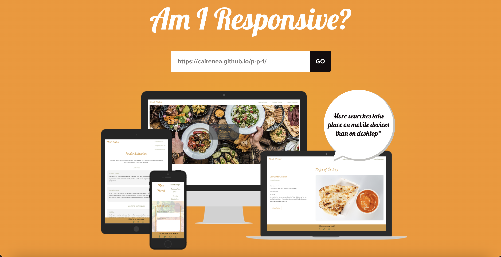
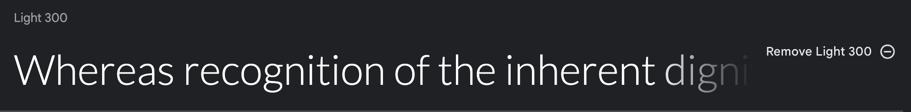
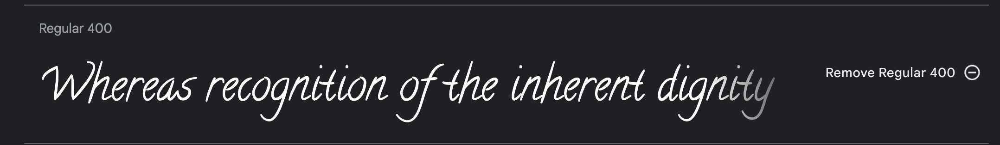
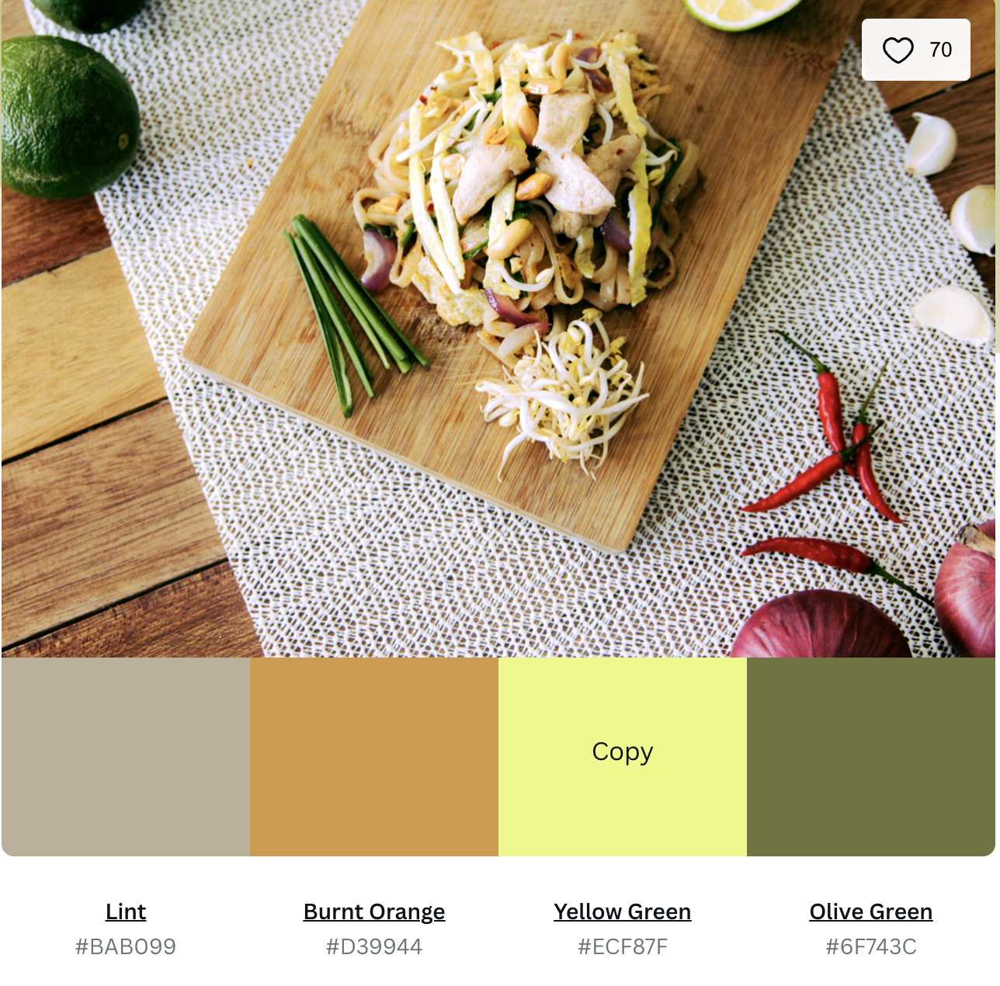
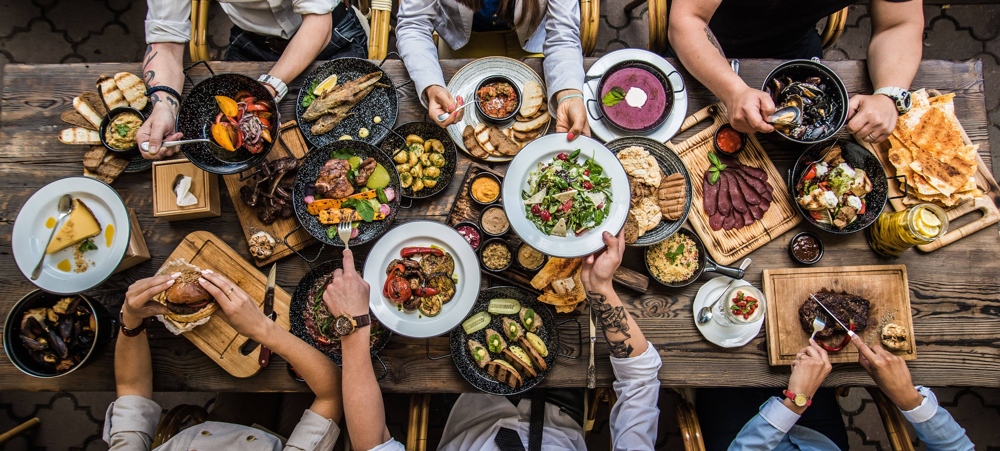

# Meal Reveal

Meal Reveal is a user-friendly web application that helps users discover new recipes, submit their food creations and update their foodie education knowledge.

[Live Site](https://cairenea.github.io/p-p-1/)

## Contents

1. [User Experience](#user-experience)
2. [Design](#design)
3. [Features](#features)
4. [Accessibility](#accessibility)
5. [Technologies Used](#technologies-used)
6. [Deployment & Local Development](#deployment--local-development)
7. [Testing](#testing)
8. [Credits](#credits)

## User Experience

### User Stories

- First-time visitors quickly clicked the main call to action inside the hero image container. 
- Returning visitors want to access their saved recipes, discover new options, and share recipes with friends and family.

## Design

### Typography

I used Google Fonts to import two main fonts: Lato and Calligraffitti.

- [Lato](https://fonts.google.com/specimen/Lato?query=lato)
- [Calligraffitti](https://fonts.google.com/specimen/Calligraffitti?query=callig)

### Color Scheme

The color palette is vibrant and appetizing, using fresh colors to create a visually appealing and user-friendly interface.

- Lint: `#BAB099`
- Burnt Orange: `#D39944`
- Yellow Green: `#ECF87F`
- Olive Green: `#6F743C`

Color scheme source: [Eat Your Greens](https://www.canva.com/colors/color-palettes/eat-your-greens/)

### Imagery

High-quality food images showcase recipes.

## Features

- Recipe submission form
- Recipe of the day section with photo and video

## Accessibility

The website follows accessibility best practices, such as using aria-labels for icons and ensuring adequate color contrast.

## Technologies Used

### Languages

- HTML
- CSS

### Libraries & Tools

- FontAwesome
- Git & GitHub
- Figma
- Google Fonts

## Deployment & Local Development

### Deployment

The site was deployed using GitHub Pages. The steps to deploy are as follows:

1. In the GitHub repository, navigate to the Settings tab.
2. From the source section drop-down menu, select the Master Branch.
3. Once the master branch has been selected, the page will be automatically refreshed with a detailed ribbon display to indicate the successful deployment.

The project is now live at this [Link](https://cairenea.github.io/p-p-1/)

## Testing

Throughout the development of the recipe website, thorough testing was conducted to ensure the functionality, usability, and responsiveness of the website. All the main features - navigation, recipe display, and video playback - were tested to ensure that they are functioning as expected, and that users can effortlessly achieve their goals.

The navigation bar was tested to ensure a smooth transition between different sections of the page. Each link was clicked and verified that it leads to the correct section.

The recipe display was tested to verify that all components of a recipe (title, ingredients, method, etc.) are displayed appropriately.The video playback feature was tested by clicking on the play button and observing if the videos load and play as expected.

The website was also tested on different browsers including Google Chrome, Mozilla Firefox, and Safari to ensure cross-browser compatibility. The website was viewed on different devices such as laptops, tablets, and mobile phones to check its responsiveness. 

During the testing process, a few bugs were encountered:

1. There was a bug where the video playback was not aligned properly on smaller screens. This was resolved by adjusting the CSS code to ensure the video element adjusts appropriately based on the screen size.

2. Another bug was discovered in the navigation bar, where the links were not aligning correctly on smaller screens. This was fixed by implementing a responsive design using media queries in CSS.

### Validator Testing

**HTML**
No errors were returned when passing through the official [W3C validator](https://validator.w3.org/)

**CSS**
No errors were found when passing through the official [(Jigsaw) validator](https://jigsaw.w3.org/css-validator/)

## Credits

### Code

- Button inside an issue with validation in index.html: [StackOverflow](https://stackoverflow.com/questions/24837102/the-element-button-must-not-appear-as-a-descendant-of-the-a-element)

- Missing header inside section element warning: [StackOverflow](https://stackoverflow.com/questions/24155024/w3c-html-validation-error-section-lacks-heading-consider-using-h2-h6-elements)

- Recipe video styling: [Blog Post](https://blog.shahednasser.com/how-to-style-a-video-player-and-create-a-custom-player/)

### Content & Media

- Hero image: [Shutterstock](https://www.shutterstock.com/image-photo/table-food-top-view-467823860)

- Recipe: [BBC Good Food](https://www.bbcgoodfood.com/recipes/easy-butter-chicken)

- Recipe photo: [Shutterstock](https://www.shutterstock.com/image-photo/indian-curry-butter-chicken-nan-by-1986712148)

- Submit recipe background: [Shutterstock](https://www.shutterstock.com/image-photo/notepad-your-recipe-herbs-spices-over-370298699)

### Acknowledgments

Thank anyone who provided assistance or inspiration during the project development.
